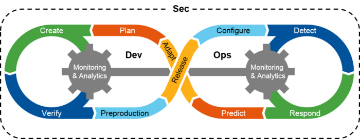
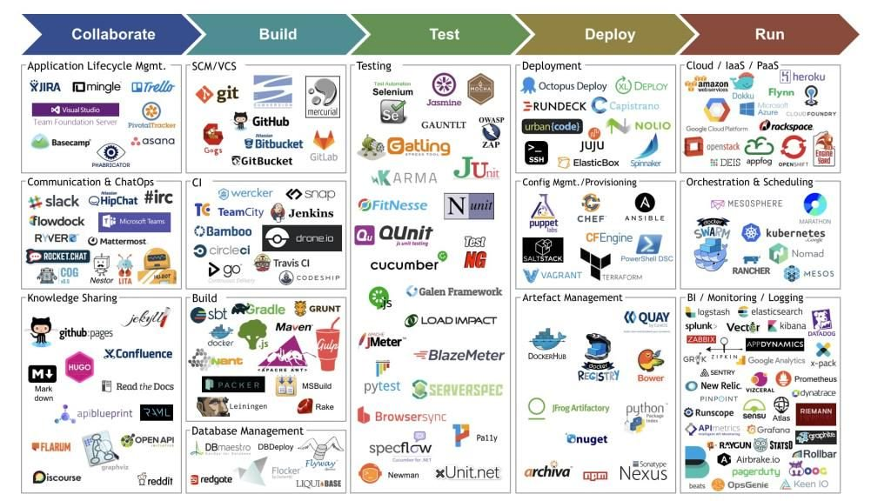

---?image=assets/img/unicorn.jpg

@title[DevSecOps: Seguridad en los tiempos del Agile]

# @color[white](DevSecOps:)

## @color[orange](Seguridad en los tiempos del Agile)

Note:

- Bienvenidos a todos, gracias por venir
- Esta es una charla sobre cómo incorporar seguridad en un proceso
- Está orientada a Agile

---
@title[Gartner projections]

@quote[By 2019, more than 70% of enterprise DevSecOps initiatives will have incorporated automated security vulnerability and configuration scanning for open-source components and commercial packages, up from less than 10% in 2016. By 2021, DevSecOps practices will be embedded in 80% of rapid development teams, up from 15% in 2017.]

---



--- 
@title[Shift-left]


## Clave: shift-left

Llevar la seguridad lo más al inicio del ciclo

---
@title[Devops toolset]

Adaptar las herramientas y procesos a los desarrolladores



Note: 

“Adapt your security testing tools and processes to the developers, not the other way around:” According to the analysts, the Sec in DevSecOps should be silent. That means the security team needs to change their processes and tools to be integrated into DevOps, instead of trying to enforce their old processes be adopted.

---?image=assets/img/superman.png&position=left&size=55% 100%
@transition[none]

@snap[east]
Desistir de intentar eliminar <br />
todas las vulnerabilidades <br />
durante el desarrollo
@snapend

Note: 

“Quit trying to eliminate all vulnerabilities during development.” “Perfect security is impossible. Zero risk is impossible. We must bring continuous risk- and trust-based assessment and prioritization of application vulnerabilities to DevSecOps,” Head and MacDonald wrote in their report. DevSecOps should be thought of as a continuous improvement process, meaning security can go beyond development and can be searching and protecting against vulnerabilities even after services are deployed into production.

---

Enfocarse en identificar y eliminar las vulnerabilidades críticas conocidas

Note: 

“Focus first on identifying and removing the known critical vulnerabilities.” Instead of wasting time trying to break a system, find focus on known security issues from pre built components, libraries, containers and frameworks; and protect against those before they are put into production.

---?image=assets/img/mastering.png&position=left&size=50% 80%

@transition[none]

@snap[east]
No esperar utilizar SAST/DAST sin cambios
@snapend

Note: 

“Don’t expect to use traditional DAST/SAST without changes.” Scan custom code for unknown vulnerabilities by integrating testing into the IDE, providing autonomous scans that don’t require a security expert, reducing false positives, and delivering results into a bug tracking system or development dashboard.

---

Entrenar todos los desarrolladores en las bases de *secure coding*
...pero no esperen que se conviertan en expertos en seguridad

Note: 

“Train all developers on the basics of secure coding, but don’t expect them to become security experts.” Training all developers on the basis of security issues will help prevent them from creating harmful scenarios. Developers should be expected to know simple threat modeling scenarios, how to think like a hacker, and know not to put secrets like cryptographic keys and passwords into the code, according to Head.  

---

Adoptar un modelo de Security Champion
Implementar una herramienta simple para recabar requerimientos de seguridad

Note: 

“Adopt a security champion model and implement a simple security requirements gathering tool.” A security champion is someone who can effectively lead the security community of practice, stay up to date with maturity issues, and evangelize, communicate and market what to do with security and how to adapt.

---?image=assets/img/manco.png&position=left&size=40% 90%

@transition[none]

@snap[east]
Eliminar el uso de componentes<br />
vulnerables en el origen
@snapend

Note: 

“Eliminate the use of known vulnerable components at the source.” “As previously stated, most risk in modern application assembly comes from the use of known vulnerable components, libraries and frameworks. Rather than wait until an application is assembled to scan and identify these known vulnerabilities, why not address this issue at its source by warning developers not to download and use these known vulnerable components,” Head and MacDonald wrote.

---

Asegurar a los scripts de automatizacion

Note: 

"Secure and apply operational discipline to automation scripts.” “Treat automation code, scripts, recipes, formation scripts and other such infrastructure and platform artifacts as valuable source code with specific additional risk. Therefore, use source-code-type controls including audit, protection, digital signatures, change control and version control to protect all such infrastructure and platform artifacts,” according to the report.


---

Implementar un fuerte control de versiones en todo el código y componentes

```bash
git init
```

Note: 

“Implement strong version control on all code and components.” Be able to capture every change from what was changed, when the change happened and who made the change.

---

Adoptar la mentalidad de infraestructura inmutable

Note: 

“Adopt an immutable infrastructure mindset.“ Teams should work towards a place where all the infrastructure is only updated by the tools. This is a sign that the team is maturing, and it provides a more secure way to maintain applications, according to Head.

---

¿Preguntas?
